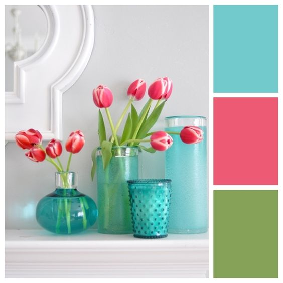

# Portafolio

### Portafolio interactivo

El objetivo es tener una sola vista en donde uno seleccione el item y aparezca el contenido.

Consiste en 4 secciones:

1. Inicio: Una imagen de presentación, el nombre e invitación a seguir mirando.

2. Portafolio: Se mostrarán los trabajos con lightbox y con link al proyecto. Tendrá tabs para ir avanzando.

3. Sobre mí: Una presentación de mis aptitudes, skills, y resumen del curriculum.

4. Contacto: Los datos de contacto y Linkedin.

### Paleta de colores

Decidí usar una gama de colores alegre y que me represente.

El objetivo es ocupar detalles de color para que resalte el contenido, sobre un fondo blanco.

 
 
### Inspiración

Quiero hacer una conexión entre mi lado visual y el código. Pensando en que están unidos finalmente por números, aparecen figuras geométricas y vectores.
Una visual simple que destaque la información, en forma rápida y agradable a la vista, ojalá quedando en la memoria del observador.

[*Carol Sepúlveda*](https://github.com/carol-solivos) Copyright (C) 2018

